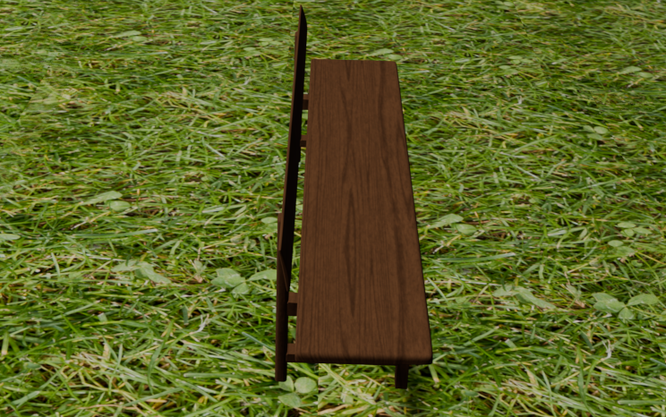

# DOT-SLAM: DROID-SLAM Optimization Using DOT

In this project [Dense Optical Tracking (DOT)](https://github.com/16lemoing/dot) (by Guillaume Le Moing, Jean Ponce, Cordelia Schmid) has been integrated into [DROID-SLAM](https://github.com/princeton-vl/DROID-SLAM/tree/main) (by Zachary Teed and Jia Deng).
The goal of this was to overcome one of the major bottlenecks of DROID-SLAM which is in the update operation, which uses partly a ConvGRU and a iterates over a refiner over and over to get the camera positions and depth map of the current frame. Aside from reducing computational power, using DOT to predict a dense flow field can be more robust if finetuned and not "just" integrated. DOT is a framework unifying point tracking and optical flow techniques without the need to refine the output for each frame as DROID does at the moment.

We achieved similar results as DROID-SLAM by integrating DOT, it however also lost some robustness as first of all the training set has not be retrained due to lack of computational power, not having a loop closure anymore as DROIDs previous update function for the depths and camera position had. This can be all finetuned more and many overly robust things from DOT are not used, like prediction of movement out of a frame is not used so many things can be omitted there as well to decrease computation time and power. 


IMAGES COLMPARISON OF DROD VS DOT

<p align="center">
  
  
</p>

<p align="center">
  <span style="display: inline-block; width: 45%; margin-right: 100px;">Description of Image 1</span>
  <span style="display: inline-block; width: 45%;">Description of Image 2</span>
</p>


## Remarks before trying to run DPT-DROID-SLAM
Running the demos will require..
* a GPU with at **least** 11G of memory.
* short video
  
For setting up the environment we recommend working on:
* Ubuntu 20.04 LTS
* Cuda 11.3
* CUDNN 8.2.1.32
  

## Getting Started
1. Clone the repo using the `--recursive` flag
```Bash
git clone --recursive https://github.com/holuca/DPT-DROID-SLAM.git
```

2. Creating a new anaconda environment using the provided .yaml file. Use `environment_novis.yaml` to if you do not want to use the visualization
```Bash
conda env create -f environment.yaml
pip install evo --upgrade --no-binary evo
pip install gdown
```

3. Compile the extensions (takes about 10 minutes)
```Bash
python setup.py install
```


## Model Zoo

### Optical flow estimation
&rarr; *find motion boundaries*

<table>
  <tr>
    <th colspan="1">Model</th>
    <th colspan="1">Data</th>
    <th colspan="2">Download</th>
  </tr>
  <tr>
    <td>RAFT</td>
    <td>Kubric-CVO</td>
    <td><a href="https://huggingface.co/16lemoing/dot/resolve/main/cvo_raft_patch_8.pth">Checkpoint</a></td>
    <td><a href="https://github.com/16lemoing/dot/blob/main/configs/raft_patch_8.json">Config</a></td>
  </tr>
</table>

### Point tracking initialization
&rarr; *track sparse queries, half at motion boundaries, half randomly*

<table>
  <tr>
    <th colspan="1">Model</th>
    <th colspan="1">Data</th>
    <th colspan="2">Download</th>
  </tr>
  <tr>
    <td>CoTracker</td>
    <td>Kubric-MOViF</td>
    <td><a href="https://huggingface.co/16lemoing/dot/resolve/main/movi_f_cotracker_patch_4_wind_8.pth">Checkpoint</a></td>
    <td><a href="https://github.com/16lemoing/dot/blob/main/configs/cotracker_patch_4_wind_8.json">Config</a></td>
  </tr>
  <tr>
    <td>CoTracker2</td>
    <td>Kubric-MOViF</td>
    <td><a href="https://huggingface.co/16lemoing/dot/resolve/main/movi_f_cotracker2_patch_4_wind_8.pth">Checkpoint</a></td>
    <td><a href="https://github.com/16lemoing/dot/blob/main/configs/cotracker2_patch_4_wind_8.json">Config</a></td>
  </tr>
  <tr>
    <td>TAPIR</td>
    <td>Kubric-Panning-MOViE</td>
    <td><a href="https://huggingface.co/16lemoing/dot/resolve/main/panning_movi_e_tapir.pth">Checkpoint</a></td>
    <td><a href="https://github.com/16lemoing/dot/blob/main/configs/tapir.json">Config</a></td>
  </tr>
  <tr>
    <td>BootsTAPIR</td>
    <td>Kubric-Panning-MOViE + Real data</td>
    <td><a href="https://huggingface.co/16lemoing/dot/resolve/main/panning_movi_e_plus_bootstapir.pth">Checkpoint</a></td>
    <td><a href="https://github.com/16lemoing/dot/blob/main/configs/bootstapir.json">Config</a></td>
  </tr>
</table>

### Optical flow refinement
&rarr; *get dense motion from sparse point tracks*

<table>
  <tr>
    <th colspan="1">Model</th>
    <th colspan="1">Input</th>
    <th colspan="1">Data</th>
    <th colspan="2">Download</th>
  </tr>
  <tr>
    <td>RAFT</td>
    <td>CoTracker</td>
    <td>Kubric-MOViF</td>
    <td><a href="https://huggingface.co/16lemoing/dot/resolve/main/movi_f_raft_patch_4_alpha.pth">Checkpoint</a></td>
    <td><a href="https://github.com/16lemoing/dot/blob/main/configs/raft_patch_4_alpha.json">Config</a></td>
  </tr>
</table>

<details>
<summary>Command line to download all checkpoints.</summary>

```
wget -P checkpoints https://huggingface.co/16lemoing/dot/resolve/main/cvo_raft_patch_8.pth
wget -P checkpoints https://huggingface.co/16lemoing/dot/resolve/main/movi_f_raft_patch_4_alpha.pth
wget -P checkpoints https://huggingface.co/16lemoing/dot/resolve/main/movi_f_cotracker_patch_4_wind_8.pth
wget -P checkpoints https://huggingface.co/16lemoing/dot/resolve/main/movi_f_cotracker2_patch_4_wind_8.pth
wget -P checkpoints https://huggingface.co/16lemoing/dot/resolve/main/panning_movi_e_tapir.pth
wget -P checkpoints https://huggingface.co/16lemoing/dot/resolve/main/panning_movi_e_plus_bootstapir.pth
```
</details> 
## Demos

1. Download the model from google drive: [droid.pth](https://drive.google.com/file/d/1PpqVt1H4maBa_GbPJp4NwxRsd9jk-elh/view?usp=sharing)

2. Download some sample videos using the provided script.
```Bash
./tools/download_sample_data.sh
```

Run the demo on any of the samples (all demos can be run on a GPU with 11G of memory). While running, press the "s" key to increase the filtering threshold (= more points) and "a" to decrease the filtering threshold (= fewer points). To save the reconstruction with full resolution depth maps use the `--reconstruction_path` flag.


```Python
python demo.py --imagedir=data/abandonedfactory --calib=calib/tartan.txt --stride=2
```

```Python
python demo.py --imagedir=data/sfm_bench/rgb --calib=calib/eth.txt
```

```Python
python demo.py --imagedir=data/Barn --calib=calib/barn.txt --stride=1 --backend_nms=4
```

```Python
python demo.py --imagedir=data/mav0/cam0/data --calib=calib/euroc.txt --t0=150
```

```Python
python demo.py --imagedir=data/rgbd_dataset_freiburg3_cabinet/rgb --calib=calib/tum3.txt
```


**Running on your own data:** All you need is a calibration file. Calibration files are in the form 
```
fx fy cx cy [k1 k2 p1 p2 [ k3 [ k4 k5 k6 ]]]
```
with parameters in brackets optional.

## Evaluation
To test our implementation additionally to the data from [TartanAir](https://theairlab.org/tartanair-dataset/) we created a more computational feasible and comparable datasets using Blender for which we also had the groud truth depthmaps and camera positions.
The videos, depthmaps, camerapositions can be downloaded from the [polybox](https://polybox.ethz.ch/index.php/s/1pTOGuFKDkqM5zf).


## Acknowledgements
Data from the original github pages of [DOT](https://github.com/16lemoing/dot) and [DROID-SLAM](https://arxiv.org/abs/2108.10869](https://github.com/princeton-vl/DROID-SLAM)) was used to test our implementation. 
